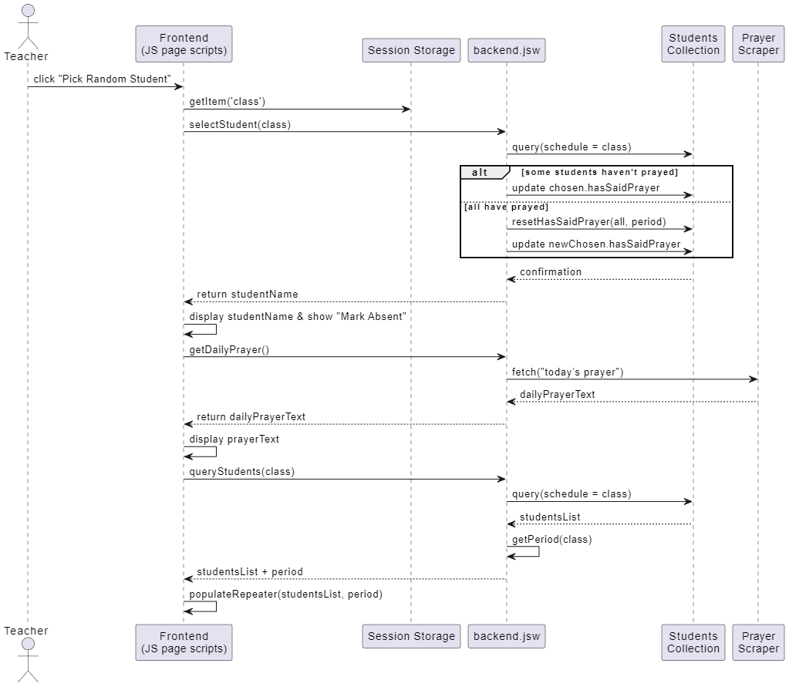

# Prayer Picker 
*A Wix Velo web‑app that fairly assigns daily prayer leaders and logs attendance for Santa Monica Prep’s classrooms.*

> Built to replace the old "call on" system, **Prayer Picker** connects to a protected Teachers database, randomises students who have not yet prayed, records completion and scrapes a fresh daily prayer. All in one click to promot a stress-free religious moment before lecture.

---

## Table of Contents
1. [Project snapshot](#project-snapshot)
2. [How it works](#how-it-works)
3. [Data model](#data-model)
4. [Getting started (local dev)](#getting-started-local-dev)
5. [Code structure](#repo-and-code-structure)
6. [License](#license)

---

## Project snapshot
|  |  |
|---|---|
|  |  |
| Secure teacher login (bcrypt‑hashed passwords) | Random picker with exclusion of absentees, live “used today” filter |

---

## How it works
1. **Teacher login** – Front‑end posts `email + password` to `backend/auth.jsw → login()`.
2. **Session token** – Backend issues a 254‑char `sessionId`, stores it with a TTL of 1 h in **Teachers** collection.
2. **Random selection** – Clicking "Pick random Student" runs students.jsw → selectStudent(sessionId, class) which:
    * Finds students who haven’t prayed in that period and aren’t marked absent.
    * Picks one via crypto.randomInt, updates their hasSaidPrayer flag for that period (e.g. if period 1, index 0 of `hasSaidPrayer` turns true).
4. **Daily prayer text** – getDailyPrayer() scrapes the Church of England “Today’s Prayer” page with cheerio and shows it on the dashboard.
5. **Daily resets** – Wix Scheduler triggers `resetAbsence()` at the end of each period.



---

## Data model
| Collection | Key fields | Purpose |
|------------|-----------|---------|
| **Teachers** | `email : string (PK)`<br>`passwordHash : string `<br> `classes: string array`<br>`sessionID: string`<br> `timestamp: UNIX epoch stamp` | Auth credentials (bcrypt 12 rounds) |
| **Students** | `_id`<br>`firstName, lastName`<br>`grade`<br>`isAbsent : boolean`<br>`hasSaidPrayer : boolean array` | Roster & daily status |

*(Both collections are **private**; only backend web‑modules may read/write.)*

---

## Getting started (local dev)

> Requires Node ≥ 18 and Wix CLI (free).

```bash
# 1  Install Wix CLI once
npm i -g @wix/cli

# 2  Clone & open workspace
git clone https://github.com/Giabbi/Prayer-Picker.git
cd Prayer-Picker
wix code open

# 3  Follow the browser prompt to log into Wix, then select a sandbox site.

# 4  Run the dev server
wix dev
```

A preview tab opens with hot‑reload for backend `.jsw` and page scripts.

---

## Repo and code structure

```
/
├── README.md
├── LICENSE
├── jobs.config.json       ← Reset sessionIDs after 1 hour, reset absences every period
├── docs/
│   ├── images/
│   └── UML/
│       ├── pick-sequence.puml
│       └── components.puml
├── src/
│   ├── backend/            
│   │   ├── auth.jsw       ← login, resetPassword, isValid, resetValid
│   │   ├── student.jsw    ← selectStudent, queryStudents, getPeriod, markAbsent
│   │   ├── reset.jsw      ← resetHasSaidPrayer, resetAbsence
│   │   └── prayer.jsw     ← getDailyPrayer
│   └── frontend/          ← page-specific code for frontend
│       ├── login.js        
│       ├── students.js
│       └── passwordReset.js
└── Loading.html            ← Shared static page for loading screen

```
**Note**: backend modules are split in the repository but not on Wix. There they will be all under a unique jsw module.


---

## License
MIT © 2025 Giancarlo Umberto Ambrosino. See `LICENSE` for details.

